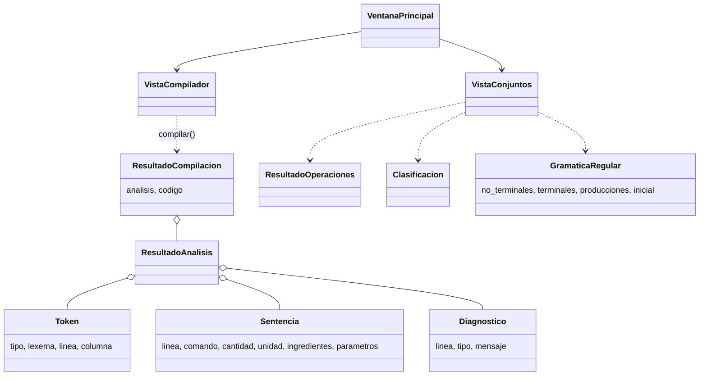
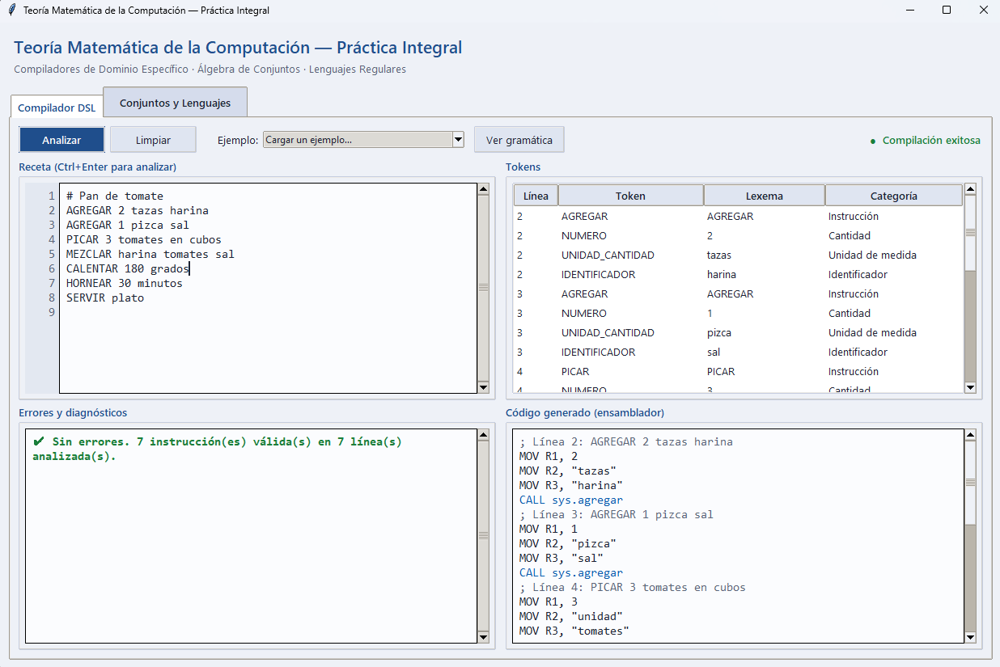
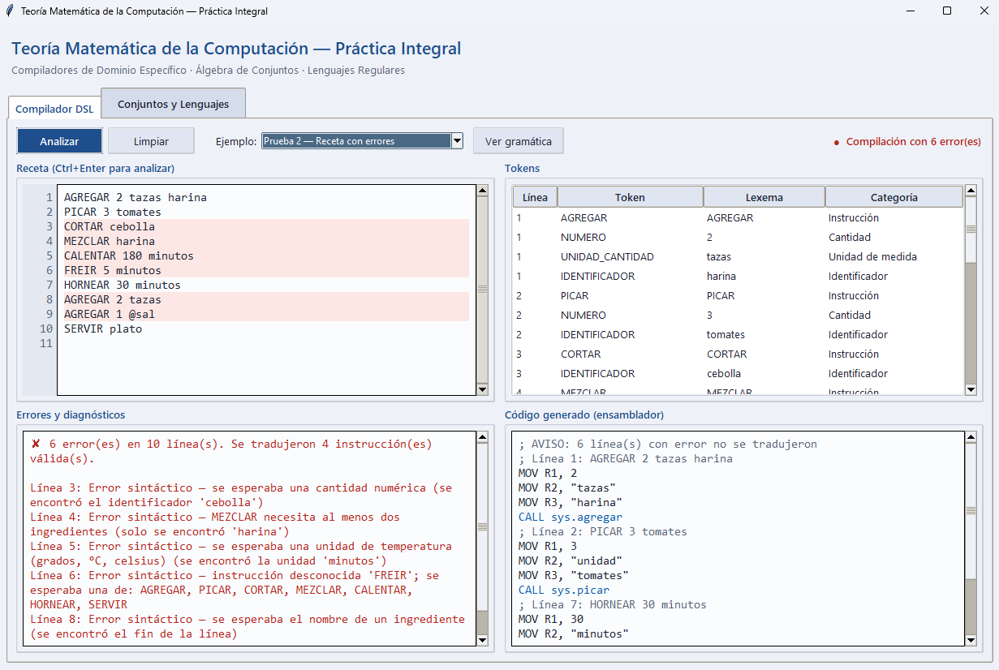
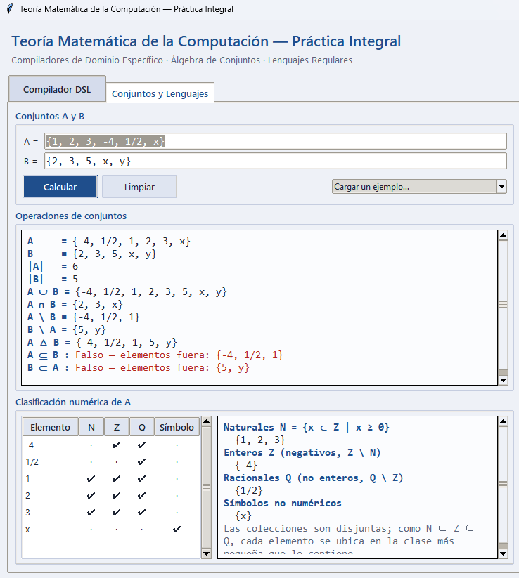
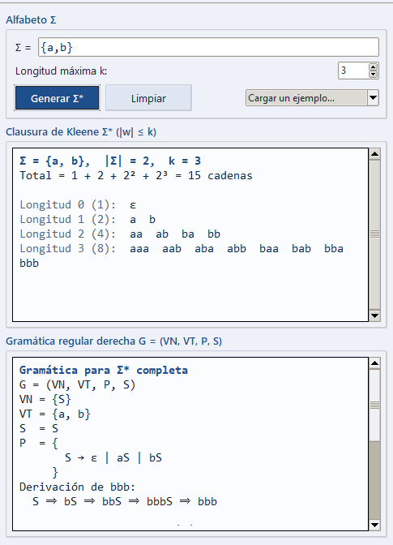

# I. Portada Institucional

**Escuela de Tecnologías Digitales Aplicadas**

**Carrera:** [COMPLETAR: nombre de la carrera]

**Asignatura:** Teoría Matemática de la Computación

**Práctica:** Práctica Integral de Laboratorio: Compiladores de Dominio Específico, Álgebra de Conjuntos y Lenguajes Regulares

**Docente:** [COMPLETAR: nombre del docente]

**Estudiante 1:** [COMPLETAR: nombre y matrícula]

**Estudiante 2:** [COMPLETAR: nombre y matrícula]

**Repositorio (GitHub):** [COMPLETAR: URL del repositorio]

**Fecha:** [COMPLETAR]

---

# II. Marco Teórico y Formalización Matemática

## 2.1 Arquitectura clásica de un compilador

Un compilador traduce un programa escrito en un lenguaje fuente a una representación en un lenguaje destino. Se divide tradicionalmente en dos grandes partes (Aho et al., 2006):

- **Front-End (análisis).** Depende del lenguaje fuente y es independiente de la máquina destino. Comprende:
  - *Análisis léxico*: agrupa los caracteres en **tokens** usando expresiones regulares (lenguajes regulares, equivalentes a autómatas finitos).
  - *Análisis sintáctico*: verifica que la secuencia de tokens pertenezca al lenguaje definido por una **gramática libre de contexto** y construye una estructura jerárquica (árbol sintáctico).
  - *Análisis semántico*: comprueba reglas de significado (tipos, declaraciones). En esta práctica se reduce a validar unidades y cantidades dentro de la propia gramática.
- **Back-End (síntesis).** Depende de la máquina destino. Comprende la generación de código intermedio o ensamblador, su optimización y la asignación de registros.

En esta práctica, el Front-End son `lexer.py` y `parser.py`; el Back-End es `code_generator.py`, que emite instrucciones de una máquina abstracta (`MOV`, `CALL`, `HALT`). No se implementa una fase de optimización, porque el PDF no la solicita.

## 2.2 Gramática formal

Una gramática es una cuádrupla G = (V_N, V_T, P, S), donde V_N es el conjunto de no terminales, V_T el de terminales, P el de producciones y S ∈ V_N el símbolo inicial. El lenguaje que genera es L(G) = { w ∈ V_T\* | S ⇒\* w }. Según la jerarquía de Chomsky (1956), las gramáticas regulares (tipo 3) generan los lenguajes que reconoce un autómata finito, y las libres de contexto (tipo 2) los que reconoce un autómata de pila.

**Gramática del recetario técnico** (implementada en `compiler/grammar.py`; los terminales son los tipos de token y `NL` es el fin de línea):

- V_N = { PROGRAMA, LINEA, SENTENCIA, AGREGACION, CORTE, CORTADOR, MEZCLA, LISTA_ID, CALOR, HORNEADO, SERVICIO, OPT_UNIDAD, PARAMS }
- V_T = { AGREGAR, PICAR, CORTAR, MEZCLAR, CALENTAR, HORNEAR, SERVIR, NUMERO, UNIDAD_CANTIDAD, UNIDAD_TEMPERATURA, UNIDAD_TIEMPO, IDENTIFICADOR, PARAMETRO, PARAMETRO_FORMA, NL }
- S = PROGRAMA
- P:

```
PROGRAMA   → LINEA PROGRAMA | ε
LINEA      → SENTENCIA NL | NL
SENTENCIA  → AGREGACION | CORTE | MEZCLA | CALOR | HORNEADO | SERVICIO
AGREGACION → AGREGAR NUMERO OPT_UNIDAD IDENTIFICADOR PARAMS
CORTE      → CORTADOR NUMERO OPT_UNIDAD IDENTIFICADOR PARAMS
CORTADOR   → PICAR | CORTAR
MEZCLA     → MEZCLAR IDENTIFICADOR LISTA_ID PARAMS
LISTA_ID   → IDENTIFICADOR LISTA_ID | IDENTIFICADOR
CALOR      → CALENTAR NUMERO UNIDAD_TEMPERATURA PARAMS
HORNEADO   → HORNEAR NUMERO UNIDAD_TIEMPO PARAMS
SERVICIO   → SERVIR IDENTIFICADOR PARAMS
OPT_UNIDAD → UNIDAD_CANTIDAD | ε
PARAMS     → PARAMETRO PARAMS | PARAMETRO_FORMA PARAMS | ε
```

La gramática es LL(1): el primer token de cada alternativa decide la producción sin retroceso, lo que justifica un analizador de descenso recursivo. `LISTA_ID` exige al menos dos ingredientes en `MEZCLAR` (decisión de diseño propia, pues el PDF no la fija).

## 2.3 Operaciones de conjuntos implementadas

Sean A y B conjuntos finitos y |X| la cardinalidad (número de elementos distintos):

- Unión: A ∪ B = { x | x ∈ A ∨ x ∈ B }
- Intersección: A ∩ B = { x | x ∈ A ∧ x ∈ B }
- Diferencia: A \ B = { x | x ∈ A ∧ x ∉ B }, análogamente B \ A
- Diferencia simétrica: A △ B = (A \ B) ∪ (B \ A) = (A ∪ B) \ (A ∩ B)
- Contención: A ⊆ B ⇔ ∀x (x ∈ A ⇒ x ∈ B) ⇔ A \ B = ∅

**Clasificación numérica.** N = { x ∈ Z | x ≥ 0 } y N ⊂ Z ⊂ Q. Para obtener colecciones disjuntas, cada elemento se asigna a la clase más pequeña que lo contiene: N; Z \ N (enteros negativos); Q \ Z (racionales no enteros). Todo lo que no es un número exacto (por ejemplo `x`, `pi`) se clasifica como símbolo no numérico. Los números se representan con `fractions.Fraction`, por lo que 2, 4/2 y 2.0 son el mismo elemento.

## 2.4 Clausura de Kleene y gramática regular derecha

Dado un alfabeto finito Σ, Σ⁰ = {ε}, Σⁱ⁺¹ = { aw | a ∈ Σ, w ∈ Σⁱ } y la clausura de Kleene es Σ\* = ⋃ᵢ≥₀ Σⁱ (Kleene, 1956). Es un conjunto infinito, por lo que la aplicación calcula la porción Σ^≤k = ⋃ᵢ₌₀ᵏ Σⁱ con k = 3 por defecto.

Una gramática regular derecha solo tiene producciones A → ε, A → a o A → aB. Para Σ = {a, b}:

- G = ({S}, {a, b}, P, S) con P = { S → ε | aS | bS }, que genera exactamente Σ\*.
- Para limitar la longitud a k, G_k usa los no terminales S = A₀, A₁, …, A_k, donde A_i recuerda cuántos símbolos se han leído: A_i → ε | aA_{i+1} | bA_{i+1} para i < k, y A_k → ε. Genera Σ^≤k.

La aplicación muestra ambas y una derivación, por ejemplo S ⇒ bS ⇒ bbS ⇒ bbbS ⇒ bbb.

---

# III. Arquitectura del Sistema

## 3.0 Repositorio de código

El código fuente completo de la práctica está disponible en el siguiente repositorio Git: **[COMPLETAR: URL del repositorio de GitHub]**

Para ejecutarlo: clonar el repositorio y correr `python main.py` desde la carpeta raíz (requiere Python 3.9 o superior; no necesita librerías externas).

## 3.1 Diagrama de paquetes

La interfaz solo depende del motor formal; el motor formal no importa Tkinter, por lo que puede probarse sin ventana (`tests/`).

```
                         main.py
                            │
                            ▼
        ┌──────────────── gui/ (Tkinter) ────────────────┐
        │  main_window · compiler_view · sets_view       │
        │  theme · widgets                               │
        └───────┬────────────────────────────┬───────────┘
                │                            │
                ▼                            ▼
   compiler/  (Módulo A)           mathematics/  (Módulo B)

   GUI                              GUI
    ↓                                ↓
   compilar()                       sets_operations
    ↓                                ↓
   Lexer  (lexer.py)                number_classifier
    ↓                                ↓
   Parser (parser.py)               kleene
    ↓                                ↓
   Generador de código              regular_grammar
   (code_generator.py)
```

Diagrama de clases (Mermaid, puede pegarse en cualquier visor compatible):



## 3.2 Tabla de expresiones regulares (`compiler/lexer.py`)

El escáner combina estas expresiones, en este orden, en una sola expresión con grupos con nombre y sin distinguir mayúsculas. `(?!\w)` evita que `AGREGARX` se reconozca como la instrucción `AGREGAR`.

| Orden | Token | Expresión regular | Ejemplo |
|---|---|---|---|
| 1 | COMENTARIO (se ignora) | `#[^\n]*` | `# pan` |
| 2 | ESPACIO (se ignora) | `[ \t\r]+` | |
| 3 | AGREGAR, PICAR, CORTAR, MEZCLAR, CALENTAR, HORNEAR, SERVIR | `<PALABRA>(?!\w)` | `HORNEAR` |
| 4 | NUMERO | `\d+(?:\.\d+)?(?![\w.])` | `2`, `0.5` |
| 5 | PARAMETRO_FORMA | `en\s+(?:cubos\|rodajas\|tiras\|trozos\|juliana)(?!\w)` | `en cubos` |
| 6 | PARAMETRO | `(?:fino\|fina\|grueso\|gruesa\|suave\|lento\|rapido\|rápido\|fuerte)(?!\w)` | `fino` |
| 7 | UNIDAD_TEMPERATURA | `(?:grados\|°C\|celsius)(?!\w)` | `grados` |
| 8 | UNIDAD_TIEMPO | `(?:segundos?\|minutos?\|horas?\|seg\|min\|h)(?!\w)` | `minutos` |
| 9 | UNIDAD_CANTIDAD | `(?:tazas?\|gramos?\|kilogramos?\|kg\|g\|mililitros?\|ml\|litros?\|l\|cucharadas?\|cucharaditas?\|piezas?\|pizcas?\|dientes?)(?!\w)` | `tazas` |
| 10 | IDENTIFICADOR | `[^\W\d]\w*` | `harina` |
| 11 | ERROR | `\S+` | `@sal`, `3tomates` |

## 3.3 Generación de código

Cada sentencia válida produce una secuencia de `MOV Rn, valor` (R1, R2, … en orden) seguida de `CALL sys.<acción>`; el programa termina con `HALT`. Los parámetros semánticos se cargan en el siguiente registro libre. Las sentencias con error no se traducen, pero no detienen el análisis.

---

# IV. Resultados y Casos de Prueba

Las capturas deben tomarse con la aplicación en ejecución (`python main.py`). Cada caso indica qué cargar, qué debe verse y qué capturar. Los resultados textuales mostrados aquí provienen de ejecuciones reales de la aplicación.

## 4.1 Prueba 1 — Receta de 7 pasos compilada correctamente

Entrada (menú *Ejemplo → Prueba 1*):

```
# Pan de tomate
AGREGAR 2 tazas harina
AGREGAR 1 pizca sal
PICAR 3 tomates en cubos
MEZCLAR harina tomates sal
CALENTAR 180 grados
HORNEAR 30 minutos
SERVIR plato
```

Resultado: indicador "Compilación exitosa", 7 instrucciones, código terminado en `HALT`:

```
; Línea 2: AGREGAR 2 tazas harina
MOV R1, 2
MOV R2, "tazas"
MOV R3, "harina"
CALL sys.agregar
; Línea 3: AGREGAR 1 pizca sal
MOV R1, 1
MOV R2, "pizca"
MOV R3, "sal"
CALL sys.agregar
; Línea 4: PICAR 3 tomates en cubos
MOV R1, 3
MOV R2, "unidad"
MOV R3, "tomates"
MOV R4, "en cubos"
CALL sys.picar
; Línea 5: MEZCLAR harina tomates sal
MOV R1, "harina"
MOV R2, "tomates"
MOV R3, "sal"
CALL sys.mezclar
; Línea 6: CALENTAR 180 grados
MOV R1, 180
MOV R2, "grados"
CALL sys.calentar
; Línea 7: HORNEAR 30 minutos
MOV R1, 30
MOV R2, "minutos"
CALL sys.hornear
; Línea 8: SERVIR plato
MOV R1, "plato"
CALL sys.servir
HALT
```

> **CAPTURA 1 — Receta de 6 pasos o más compilada exitosamente.** Pestaña *Compilador DSL* con la Prueba 1 analizada: editor, tabla de tokens, mensaje "Sin errores", código generado y el indicador verde.
>
> {width=15.5cm}

## 4.2 Prueba 2 — Errores sintácticos

Entrada (menú *Ejemplo → Prueba 2*):

```
AGREGAR 2 tazas harina
PICAR 3 tomates
CORTAR cebolla
MEZCLAR harina
CALENTAR 180 minutos
FREIR 5 minutos
HORNEAR 30 minutos
AGREGAR 2 tazas
AGREGAR 1 @sal
SERVIR plato
```

Diagnósticos obtenidos (el análisis continúa tras cada error; las líneas 1, 2, 7 y 10 se traducen):

```
Línea 3: Error sintáctico — se esperaba una cantidad numérica (se encontró el identificador 'cebolla')
Línea 4: Error sintáctico — MEZCLAR necesita al menos dos ingredientes (solo se encontró 'harina')
Línea 5: Error sintáctico — se esperaba una unidad de temperatura (grados, °C, celsius) (se encontró la unidad 'minutos')
Línea 6: Error sintáctico — instrucción desconocida 'FREIR'; se esperaba una de: AGREGAR, PICAR, CORTAR, MEZCLAR, CALENTAR, HORNEAR, SERVIR
Línea 8: Error sintáctico — se esperaba el nombre de un ingrediente (se encontró el fin de la línea)
Línea 9: Error léxico — símbolo no reconocido '@sal' (columna 11)
```

> **CAPTURA 2 — Errores sintácticos.** Pestaña *Compilador DSL* con la Prueba 2 analizada: líneas con error resaltadas en rojo, panel de diagnósticos e indicador "Compilación con 6 error(es)".
>
> {width=15.5cm}

## 4.3 Prueba 3 — Conjuntos con elementos mixtos

Datos: `A = {1, 2, 3, -4, 1/2, x}`, `B = {2, 3, 5, x, y}`.

| Operación | Resultado |
|---|---|
| \|A\| / \|B\| | 6 / 5 |
| A ∪ B | {-4, 1/2, 1, 2, 3, 5, x, y} |
| A ∩ B | {2, 3, x} |
| A \ B | {-4, 1/2, 1} |
| B \ A | {5, y} |
| A △ B | {-4, 1/2, 1, 5, y} |
| A ⊆ B | Falso (elementos fuera: {-4, 1/2, 1}) |
| B ⊆ A | Falso (elementos fuera: {5, y}) |

Clasificación de A: Naturales {1, 2, 3}; Enteros (negativos) {-4}; Racionales no enteros {1/2}; Símbolos {x}.

> **CAPTURA 3 — Operaciones de conjuntos.** Pestaña *Conjuntos y Lenguajes* tras pulsar *Calcular*, con el panel "Operaciones de conjuntos" visible.
>
> {width=10cm}
>
> **CAPTURA 4 — Clasificación numérica.** Mismo estado; debe verse el panel "Clasificación numérica de A" (tabla y colecciones).
>
> {width=10cm}

## 4.4 Pruebas 4 y 5 — Clausura de Kleene para dos alfabetos

**Σ = {a, b}, k = 3** (15 cadenas = 1 + 2 + 2² + 2³):

```
Longitud 0 (1):  ε
Longitud 1 (2):  a  b
Longitud 2 (4):  aa  ab  ba  bb
Longitud 3 (8):  aaa  aab  aba  abb  baa  bab  bba  bbb
```

Gramática: G = ({S}, {a, b}, {S → ε | aS | bS}, S); G₃ con VN = {S, A₁, A₂, A₃}.

> **CAPTURA 5 — Σ\* para el alfabeto {a,b}.** Secciones "Clausura de Kleene" y "Gramática regular" con el ejemplo *Prueba 4*.
>
> {width=8cm}

**Σ = {0, 1}, k = 3** (15 cadenas): ε; 0, 1; 00, 01, 10, 11; 000, 001, 010, 011, 100, 101, 110, 111. Con Σ = {x, y, z} se obtienen 1 + 3 + 9 + 27 = 40 cadenas.

> **CAPTURA 6 — Segundo alfabeto.** Ejemplo *Prueba 5 — Σ = {0,1}* (o *Σ = {x,y,z}*) generado.
>
> *[Insertar captura aquí]*

## 4.5 Pruebas automáticas

`python -m unittest discover -v` ejecuta 23 pruebas (lexer, parser, generación de código, conjuntos, clasificación, Kleene, gramáticas). Todas pasan.

---

# V. Análisis de Complejidad y Discusión

## 5.1 Complejidad de la generación de Σ\*

Sea n = |Σ| y k la longitud máxima. Hay nⁱ cadenas de longitud i, por lo que el total es

N(n, k) = 1 + n + n² + … + nᵏ = (n^(k+1) − 1)/(n − 1)  para n ≥ 2.

Como (n^(k+1) − 1)/(n − 1) ≤ nᵏ · n/(n − 1) ≤ 2nᵏ, se cumple N(n, k) = Θ(nᵏ): el tamaño de la salida crece de forma **exponencial en k** y polinomial en n para k fijo. Para n = 1 la suma vale k + 1 = Θ(k).

Construir cada cadena de longitud i cuesta O(i), así que el tiempo total es Σᵢ i·nⁱ = Θ(k·nᵏ), es decir, **O(k · nᵏ)**. La memoria necesaria para almacenar el resultado tiene el mismo orden. La salida es en sí misma de tamaño exponencial, por lo que ningún algoritmo puede ser asintóticamente mejor que Ω(nᵏ).

| n \ k | 1 | 2 | 3 | 4 | 5 |
|---|---|---|---|---|---|
| 2 | 3 | 7 | 15 | 31 | 63 |
| 3 | 4 | 13 | 40 | 121 | 364 |
| 10 | 11 | 111 | 1 111 | 11 111 | 111 111 |

Por esta razón, `kleene.py` rechaza generaciones de más de 20 000 cadenas y la interfaz limita k a 6.

## 5.2 Expresiones regulares frente a autómatas de pila

Las expresiones regulares describen lenguajes regulares, reconocibles con un autómata finito, es decir, con memoria acotada. Bastan para el análisis léxico, donde cada token es un patrón local (palabras reservadas, números, unidades, identificadores).

Sin embargo, no pueden reconocer estructuras que requieren contar o emparejar elementos sin cota, como L = { aⁿbⁿ | n ≥ 0 } o los paréntesis balanceados, lo cual se demuestra con el lema de bombeo para lenguajes regulares (Sipser, 2013). Esos lenguajes son libres de contexto y requieren un **autómata de pila**, cuya pila aporta memoria no acotada. Por eso el análisis sintáctico de lenguajes con anidamiento (bloques, expresiones con paréntesis) se basa en gramáticas libres de contexto.

En este DSL, cada línea es una sentencia plana sin anidamiento, así que su estructura podría haberse validado con una única expresión regular por instrucción. Se usó un parser de descenso recursivo sobre una gramática LL(1) porque separa claramente las fases del Front-End, permite diagnósticos precisos (qué se esperaba y qué se encontró) y es extensible: si el recetario incorporara bloques anidados (por ejemplo `REPETIR n ... FIN`), el parser seguiría funcionando, mientras que un enfoque solo con expresiones regulares dejaría de ser suficiente.

## 5.3 Alcances y limitaciones

- El vocabulario (unidades, parámetros) es una lista cerrada; añadir palabras exige editar `lexer.py`.
- No existe análisis semántico real (por ejemplo, no se comprueba que un ingrediente se haya agregado antes de picarse).
- El ensamblador es una máquina abstracta: no hay ejecutor ni optimizador.
- Los irracionales (π, √2) no son representables y se clasifican como símbolos.

---

# VI. Conclusiones y Referencias

> Las conclusiones individuales son un borrador para que cada integrante lo adapte con sus propias palabras y su participación real.

## 6.1 Conclusiones individuales

**Integrante 1 — [COMPLETAR nombre].** Esta práctica me permitió ver que un compilador no es una pieza única, sino una cadena de fases con responsabilidades bien separadas. Al definir cada token con una expresión regular entendí por qué el orden de las reglas importa: si las unidades se probaran después del identificador genérico, palabras como `tazas` se clasificarían como identificadores. También comprobé que reportar el error de una línea y seguir con las demás exige que el analizador no dependa del estado de las líneas anteriores. Por último, la gramática LL(1) me mostró cómo una buena definición formal reduce el parser a funciones pequeñas.

**Integrante 2 — [COMPLETAR nombre].** En mi parte trabajé sobre todo con el álgebra de conjuntos y la clausura de Kleene. Lo que más me sorprendió fue que usar números como `Fraction` evita errores de comparación: con `float`, 0.1 y 1/10 no son el mismo valor exacto, mientras que con `Fraction` sí coinciden. En la clausura de Kleene confirmé en la práctica el crecimiento exponencial: con tres símbolos y k = 5 ya hay 364 cadenas, y con diez símbolos superan las cien mil. Escribir la gramática regular derecha, con los no terminales A₀…A_k, me ayudó a entender cómo un autómata finito "recuerda" cuántos símbolos ha leído.

## 6.2 Conclusión general

La práctica integró tres áreas de la asignatura en una sola aplicación: matemáticas discretas (operaciones y clasificación de conjuntos), teoría de lenguajes formales (Σ\* y gramáticas regulares) y fundamentos de compilación (análisis léxico, sintáctico y generación de código). Separar el motor formal de la interfaz gráfica permitió probar la lógica de forma automática, sin abrir ventanas, y mantener la interfaz como una capa delgada. Los resultados cumplen lo solicitado: una receta de siete pasos se traduce a ensamblador, los errores se reportan con línea y motivo sin detener el análisis, y Σ\* se genera correctamente para distintos alfabetos. El análisis de complejidad mostró que el costo está dominado por el tamaño de la salida, Θ(nᵏ), y la discusión sobre autómatas de pila delimitó hasta dónde llegan las expresiones regulares y por qué el análisis sintáctico requiere gramáticas libres de contexto. Como trabajo futuro quedan un análisis semántico y la ejecución de la máquina abstracta.

## 6.3 Referencias (formato APA 7)

Aho, A. V., Lam, M. S., Sethi, R., & Ullman, J. D. (2006). *Compilers: Principles, techniques, and tools* (2.ª ed.). Addison-Wesley.

Chomsky, N. (1956). Three models for the description of language. *IRE Transactions on Information Theory, 2*(3), 113–124. https://doi.org/10.1109/TIT.1956.1056813

Cormen, T. H., Leiserson, C. E., Rivest, R. L., & Stein, C. (2009). *Introduction to algorithms* (3.ª ed.). MIT Press.

Hopcroft, J. E., Motwani, R., & Ullman, J. D. (2006). *Introduction to automata theory, languages, and computation* (3.ª ed.). Pearson.

Kleene, S. C. (1956). Representation of events in nerve nets and finite automata. En C. E. Shannon & J. McCarthy (Eds.), *Automata studies* (pp. 3–41). Princeton University Press.

Python Software Foundation. (s. f.). *The Python standard library* (módulos `re`, `fractions`, `itertools`, `tkinter`). https://docs.python.org/3/library/

Rosen, K. H. (2019). *Discrete mathematics and its applications* (8.ª ed.). McGraw-Hill Education.

Sipser, M. (2013). *Introduction to the theory of computation* (3.ª ed.). Cengage Learning.
